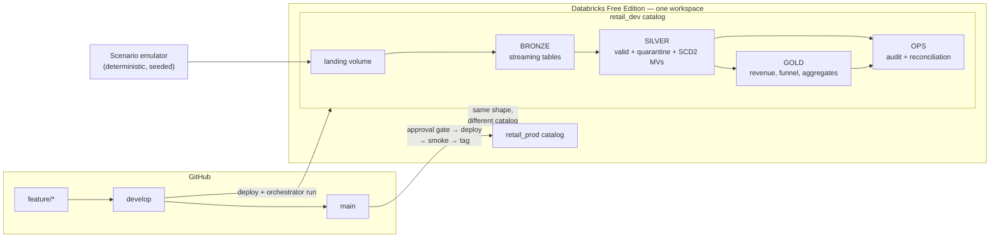
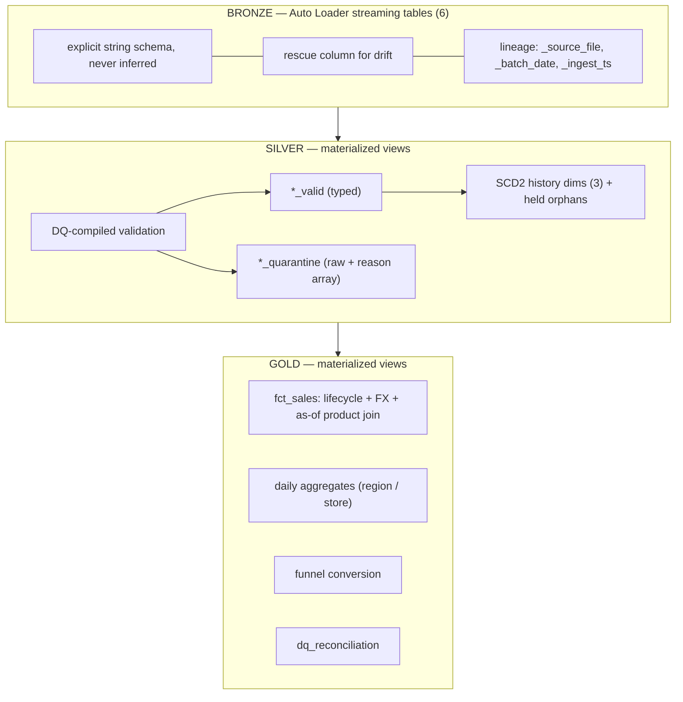
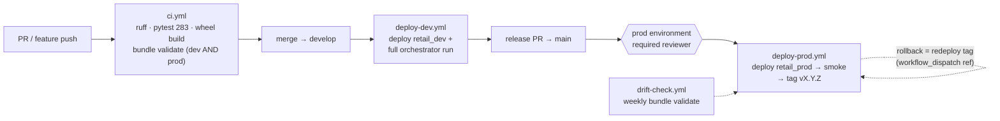
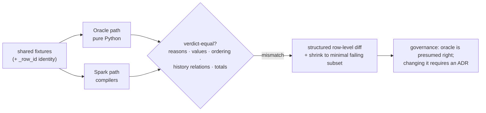

# Retail Lakehouse Platform

**A production-grade Databricks data engineering platform** — Lakeflow Spark Declarative Pipelines, Unity Catalog, Databricks Asset Bundles, and GitHub Actions, running end-to-end on Databricks Free Edition with a fully gated release process.

[](https://github.com/pattarakornmarkk-web/Retail-Lakehouse/actions/workflows/deploy-dev.yml)
[](https://github.com/pattarakornmarkk-web/Retail-Lakehouse/actions/workflows/deploy-prod.yml)
[](https://github.com/pattarakornmarkk-web/Retail-Lakehouse/releases)
[](pyproject.toml)
[](https://spark.apache.org)
[](LICENSE)

---

## 1. Executive Summary

This project implements a complete retail lakehouse: three source ingestion patterns (batch snapshots, a CDC feed with inserts/updates/deletes, and multi-emitter streaming events) flowing through a medallion architecture with quarantine-based data quality, SCD Type 2 history, exact-decimal revenue with FX normalization, and run-level audit that traces **every number in production back to a git commit**.

What distinguishes it is *how* correctness is established:

- **Oracle-first semantics** — every business rule is defined as pure, deterministic Python before any Spark exists.
- **Differential testing** — the Spark layer is held verdict-equal to that oracle on shared fixtures; 60 differential cases plus seeded property tests caught real defects (a +7-hour JVM timezone shift, a null-semantics divergence, Spark 4 ANSI cast traps) before production ever saw them.
- **Conservation by construction** — `bronze == valid + quarantine` is enforced by three independent mechanisms that must agree.
- **A deterministic fault-injection emulator** — every failure mode a real pipeline faces (late data, replays, deletes, schema drift, poison records) is a named, reproducible scenario with three tiers of proof: unit test → differential test → recorded production-like run.

**Current state:** v1.0.4 in production (`retail_prod`), five gated releases shipped, 283 tests green, all 8 fault scenarios proven on the workspace with evidence recorded in [docs/testing.md](docs/testing.md).

### How this was built

I used Claude as a pair programmer throughout, and the commit history says so
explicitly. I'd rather state that plainly than have you find it.

What it means in practice: every architectural decision here is mine and I can defend
it on a whiteboard — why silver and gold are materialized views instead of streaming
tables, why cancellation is sticky-terminal, why the SCD2 change hash excludes
ordering columns, why orphan deletes are held rather than dropped. Those are written
up as [ADRs](docs/adr/README.md) because they were *decisions*, not defaults.

The documented failures are the honest test of that claim: a +7-hour timezone shift
that only differential testing could expose, 4,950 rows quarantined by my own
framework working correctly, and a wheel that was built and wired to nothing. Finding
and fixing those required understanding the system, not generating it.

## 2. Business Problem

A retail company receives data from systems that fail in different ways:

| Source | Pattern | Real-world failure modes |
|---|---|---|
| `customers` | Weekly full snapshots (CSV) | Null keys, duplicates, impossible dates, invalid domains |
| `products` | Daily delta snapshots | Price changes needing history, dual currency |
| `stores` | Irregular snapshots | Stale re-deliveries, out-of-order updates |
| `customer_updates` | CDC feed, 2 emitters (I/U/D ops) | Late arrivals, out-of-order events, orphan deletes, replays |
| `order_events` | Streaming JSONL, 2 regional POS emitters | Duplicate events, lifecycle disorder, schema drift, THB/USD mix |
| `customer_activity` | High-volume clickstream | At-least-once duplicates, format drift, anonymous users |

The business needs trustworthy revenue (exact decimals, currency-normalized, cancellation-aware), point-in-time-correct dimensions (what was the price *when the sale happened*), conversion funnels, and the ability to answer *"where did this number come from?"* — down to the source file and the deploying commit.

## 3. Architecture Overview



Environment isolation is **catalog-level** (Free Edition provides one workspace). A runtime guard makes any cross-environment write fail at pipeline graph-build time — before a single table is touched. Every architectural decision is recorded as an ADR: [docs/adr/](docs/adr/README.md).

## 4. Key Engineering Challenges

| Challenge | Why it's hard | Where it's solved |
|---|---|---|
| Correctness you can prove, not assert | Spark semantics (null ordering, decimal scale, timezone handling, ANSI casts) silently diverge from intent | §11 Differential Testing |
| Late / out-of-order / replayed CDC | Ordering must come from business time, ties must break deterministically, replays must be no-ops | §7 CDC & SCD2 |
| One workspace, two environments | No workspace-level isolation on Free Edition | Catalog isolation + runtime guard (ADR-0001) |
| Reproducible failure testing | "It handles bad data" is unfalsifiable without deterministic bad data | Scenario emulator, §16 |
| Money | Floating point is not money; FX must be effective-dated and exact | Decimal end-to-end, division by per-base rates, single quantization point |
| Config drift | Hand-edited config tables diverge between environments | Config as versioned YAML, packaged into the wheel (ADR-0003/0008) |

## 5. Solution Design

The load-bearing idea is a strict two-layer split:

1. **The Oracle** (`src/retail_lakehouse/{dq,transform,...}`) — pure Python, zero Spark (enforced by an import-wall meta-test), millisecond-fast, exhaustively unit-tested. It *defines* what every rule means: DQ verdicts, dedup winners, CDC normalization, SCD2 intervals, revenue lifecycle, FX rounding, funnel stages.
2. **The Compilers** (`src/retail_lakehouse/spark/`) — translations of the oracle into Spark, each held verdict-equal by differential tests. For stateful logic (revenue lifecycle, funnel attribution) the oracle itself runs inside executors via `applyInPandas` — zero translation risk (ADR-0011).

Completeness is machine-enforced: a DQ rule type cannot exist without a compiler entry, a scenario fault cannot exist without a generator handler, and a source cannot lose its minimum rule coverage — CI fails on the *absence* of things.

## 6. Bronze / Silver / Gold Architecture



| Layer | Compute model | Rationale |
|---|---|---|
| Bronze | Streaming (Auto Loader) | Exactly-once file ingestion via path checkpoints; raw preservation (all strings + rescue) |
| Silver / Gold | Materialized views | Batch-scoped semantics (duplicate detection, SCD2 rebuild) match the oracle exactly; recompute correctness handles late data and replays *by construction* (ADR-0010) |

Gold's as-of join answers the classic dimensional question correctly: a March sale joins the product version **valid in March**, never today's row.

## 7. CDC & SCD Type 2 Design

**Ordering is one concept everywhere:** `(sequence_by columns, tiebreak)` per entity contract (ADR-0009), with nulls ordered lowest and an emulator-generated `(source_file, in-file row)` composite as the deterministic tiebreak of last resort.

- **Snapshot + CDC unification (ADR-0004):** customer snapshots become synthetic upsert events sequenced by `updated_at` and union with the CDC feed — one stream, one application path, nothing to reconcile.
- **Normalization:** replays (identical key+op+sequence+payload) drop and are counted; same-slot conflicts resolve deterministically and are flagged; **orphan deletes are tagged and held** in an inspectable table — never applied, never dropped (ADR-0006).
- **SCD2 as event-merge + rebuild:** history and incoming events merge per key, no-change states collapse by content hash, intervals materialize with `valid_from`/`valid_to` from *business time only*. Late corrections slot mid-history and replays add zero rows — not as special cases, but as consequences of the algorithm. Deletes are tombstones (chain closed, replay-idempotent, reinstatement supported).
- **Invariants** checked after every run: exactly one current version per live key, contiguous non-overlapping intervals, open-ended chain tails.

Op-aware data quality: a CDC delete image legitimately carries nulls outside its key — the DQ layer suppresses non-key null checks for `op=D` rows while still quarantining a null *sequence* (unusable for ordering) regardless of op.

## 8. Data Quality Framework

Rules are **data, not code** ([conf/dq_rules.yml](conf/dq_rules.yml)) — 8 rule types (`null_key`, `duplicate`, `domain`, `format`, `range`, `plausibility`, `try_cast`, `rescue_rate`) across 3 severity tiers:

| Tier | Behavior | Example |
|---|---|---|
| `quarantine` | Row split to `*_quarantine` with a sorted **reason array** | `birth_date_try_cast` for `1899-13-45` |
| `observe` | Row stays valid; violation measured | clickstream format drift |
| `gate` | Pipeline-level threshold | rescue-rate cap on schema drift |

Semantics worth noting: blank strings are null everywhere; coercion failure flags (`try_cast`) rather than crashes (Spark 4 ANSI-safe); duplicates distinguish exact re-deliveries (`row_duplicate`) from same-key conflicts (`key_duplicate`); validation is side-effect-free and every input row lands in exactly one of valid/quarantine — **conservation is asserted inside the engine**, recomputed by an in-DAG reconciliation view, and re-verified by a post-run invariants task that fails the job. Three definitions must agree.

## 9. Governance & Auditability

- **Row → commit lineage:** `ops.pipeline_runs` records every run with `git_sha` and `deployed_by`; `ops.dq_results` records quarantine reasons per run. Bronze lineage columns (`_source_file`, `_batch_date`) make every silver/gold row traceable to a landing file.
- **Environment guard (R1):** `retail_prod` paired with a `dev` tag refuses to run at graph build — covered by unit tests and fired for real once during development.
- **Release governance:** `main` is PR-only with required status checks; production deployment requires **human approval** on a GitHub `prod` environment restricted to `main`; every release is tagged (the rollback anchor — see [docs/runbook.md](docs/runbook.md)).
- **Threat model, stated not hidden:** single CI identity on Free Edition, solo-admin branch bypass (the hard stop is the environment reviewer), local Spark ≠ serverless runtime (the deployed orchestrator run is the arbiter).

## 10. CI/CD Pipeline



Both bundle targets validate on every PR (a prod-only template error cannot wait for release day). The `develop` deployment *is* the staging bake — it runs the entire pipeline against emulated data on every merge. `ops-run.yml` provides manual scenario execution with optional full refresh.

## 11. Differential Testing Strategy

The signature engineering practice of this repo:



60 differential cases (imported *verbatim* from the oracle unit suites — zero fixture duplication) plus seeded property tests. Comparisons pin the hard parts explicitly: exact `Decimal` equality, null-ordering parity (`asc_nulls_first` ≡ oracle's None-lowest), CDC event tuples, and SCD2 as a canonical history relation compared **after every incremental batch**. Defects the harness caught before production: JVM-timezone collect() shift (+7h), blank-string null semantics, and its own comparator fragilities.

## 12. Production Deployment

Two releases shipped through the full gated path:

| Release | Date | Content | Evidence |
|---|---|---|---|
| [v1.0.0](https://github.com/pattarakornmarkk-web/Retail-Lakehouse/releases/tag/v1.0.0) | 2026-07-15 | First production release | prod smoke: orchestrator `TERMINATED SUCCESS` on `retail_prod` |
| [v1.0.1](https://github.com/pattarakornmarkk-web/Retail-Lakehouse/releases/tag/v1.0.1) | 2026-07-17 | Day-1 validation: all 8 scenarios proven on the workspace | run ids + reasons in [docs/testing.md](docs/testing.md) |

Deployment is exclusively via Databricks Asset Bundles — no hand-made workspace objects. Targets differ only by variables and mode ("parity by construction"); dev/prod schema names resolve through resource references so code never hardcodes a schema literal.

## 13. Project Structure

```
├── src/retail_lakehouse/
│   ├── config/          # registries loader, pipeline params, R1 environment guard
│   ├── dq/              # ORACLE: rule engine, reasons, conservation
│   ├── transform/       # ORACLE: dedup, CDC, SCD2, revenue, FX, funnel, aggregates
│   ├── ingest/          # filenames, lineage, batch semantics, CDC prep
│   ├── scenarios/       # scenario parser + deterministic generator + writer
│   ├── spark/           # COMPILERS: dq, cdc, scd2, gold, types, SDP declarations
│   ├── audit/           # pipeline_runs, dq_results, invariants
│   └── entrypoints/     # wheel console-scripts for job tasks
├── transforms/          # 3 registration-only SDP files (all logic in the wheel)
├── conf/                # contracts, DQ rules, FX rates — packaged into the wheel
├── mock_data/scenarios/ # 8 fault-injection scenario days
├── resources/           # DAB: pipeline, jobs, schemas
├── tests/               # unit (oracle) · differential · data_quality meta-tests
├── docs/                # architecture, 11 ADRs, runbook, testing traceability
└── .github/workflows/   # ci, deploy-dev, deploy-prod, ops-run, drift-check
```

The pure packages can never import pyspark — a meta-test walks the source tree and fails CI if the import wall is breached.

## 14. Local Development Setup

```bash
git clone https://github.com/pattarakornmarkk-web/Retail-Lakehouse && cd Retail-Lakehouse
python3 -m venv .venv && source .venv/bin/activate
pip install -e ".[dev]"

pytest -m "not spark"                          # oracle tier: ~4 seconds, no JVM
pytest -m "(unit or dq) and not integration"   # full suite incl. differential (Java 17+)
ruff check . && ruff format --check .
```

The oracle tier needs nothing but Python — most business-logic work never starts a JVM. Timezone, decimal, and executor-path pinning for the Spark tier live in [tests/conftest.py](tests/conftest.py).

## 15. Databricks Deployment

```bash
databricks auth login --host <your-workspace>
databricks bundle validate --target dev
databricks bundle deploy   --target dev        # pipeline + 3 jobs + schemas + volume
databricks bundle run source_emulator --target dev --params scenario=day1_clean
databricks bundle run orchestrator    --target dev
```

The orchestrator chains: emulator (dev only, condition-gated) → SDP pipeline update → post-run audit → invariants (non-zero exit fails the job). Production deploys only through the gated GitHub workflow — see §10.

## 16. Example Pipeline Run

Clean day (`day1_clean`) on `retail_dev`:

```
customers          bronze= 5,000  valid= 5,000  quarantine= 0  conserved=True
products           bronze=   300  valid=   300  quarantine= 0  conserved=True
stores             bronze=    25  valid=    25  quarantine= 0  conserved=True
customer_updates   bronze=    50  valid=    50  quarantine= 0  conserved=True
order_events       bronze= 1,000  valid= 1,000  quarantine= 0  conserved=True
customer_activity  bronze=20,000  valid=20,000  quarantine= 0  conserved=True
all invariants healthy
```

Poison day — every injected fault caught with its exact reason, nothing else touched:

```
  reason customers.customer_id_null_key: 2      reason customer_updates.op_domain: 1
  reason customers.loyalty_tier_domain: 2       reason customer_updates.change_ts_null_key: 1
  reason customers.birth_date_try_cast: 2       reason order_events.event_ts_plausibility: 1
  reason customers.row_duplicate: 2             reason order_events.quantity_range: 1
  reason order_events.customer_id_null_key: 1   reason order_events.key_duplicate: 2
all invariants healthy
```

Full scenario matrix (late CDC, out-of-order, deletes/orphans, schema drift, source silence) with run ids: [docs/testing.md](docs/testing.md).

## 17. Lessons Learned

1. **Semantics before Spark pays for itself immediately.** Every hard decision (null ordering, tie-breaks, cancellation stickiness, rounding) was made in a millisecond-fast test loop; Spark work became translation with a proof obligation instead of design under pressure.
2. **The differential harness catches what code review can't.** A +7h timezone shift from `collect()` using the JVM zone (not the session zone) produced *plausible* wrong data — only verdict comparison against an independent implementation exposed it.
3. **Declared ≠ wired.** The project's original ancestor built a wheel nothing consumed; this repo nearly repeated it twice. Cross-reference meta-tests (entry points ↔ job tasks, rule types ↔ compilers, faults ↔ handlers) turn that failure class into CI errors.
4. **Exactly-once has sharp edges.** Auto Loader's path checkpoint silently ignores re-used file names — which is both the replay guarantee working and, when two scenarios shared a logical clock, a test that silently didn't run. Determinism must extend to *identifiers*, not just content.
5. **Real runs teach what local runs can't.** Development-mode schema prefixing, ANSI cast behavior, eager actions being illegal at SDP graph-build time, and cross-batch snapshot duplicates all surfaced only on the workspace — which is why the dev deployment runs the full pipeline on every merge.
6. **Make gates exist before you need them.** Branch protection and the prod approval environment were designed early but only *verified to exist* during release review — via API, not assumption.

## 18. Roadmap

| Priority | Item | Notes |
|---|---|---|
| v1.1 | Scope duplicate rule per `_batch_date` for snapshot sources | Day-1 finding: re-sent snapshots accumulate cross-batch `key_duplicate` |
| v1.1 | Assert scenario outcomes automatically, not by reading run output | Today the dev orchestrator run + invariants task are the gate; scenario expectations live in docs, not code |
| v1.1 | Ops dashboard + SQL alerts | `ops.pipeline_runs` / `dq_results` already carry the data |
| v1.2 | `auto_cdc_flow` cross-check | Compare managed SCD2 against the compiler's canonical relation (ADR-0002/0010) |
| v1.2 | Event-log-based audit enrichment | Would land as one isolated module; kept off the critical path so a platform change can't break auditing |
| v2 | PII tagging & masking, per-env service principals, streaming silver at scale | Paid-tier path |

---

**License:** [MIT](LICENSE) · **Decisions:** [11 ADRs](docs/adr/README.md) · **Operations:** [runbook](docs/runbook.md) · **Change history:** [CHANGELOG](CHANGELOG.md)
