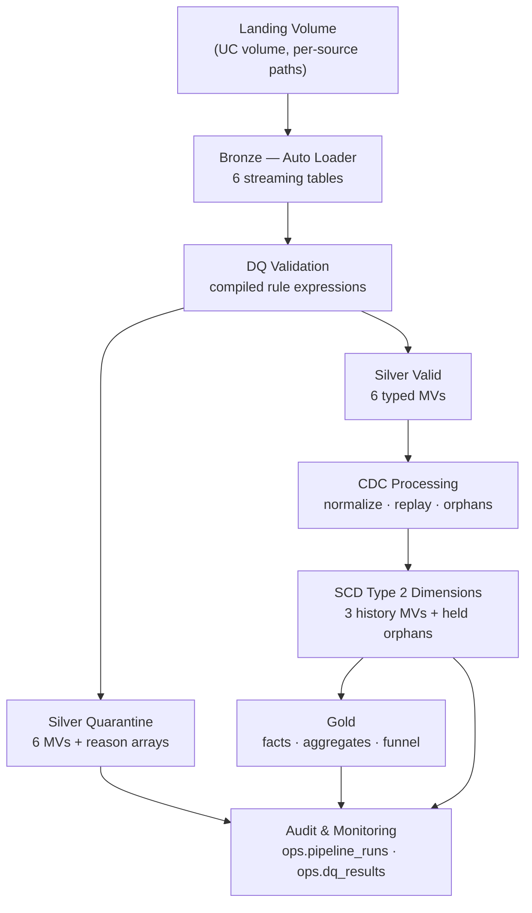
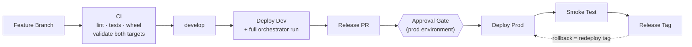

# Architecture

Detailed companion to the [README](../README.md). The README explains *what and why*
for a first-time reader; this document is the *internals* reference: object
inventory, semantics, and the rules the runtime enforces.

## Overview

Retail Lakehouse built on Databricks using:

- **Unity Catalog** — catalogs as environments, schemas per layer, volumes for landing
- **Lakeflow Declarative Pipelines** — one pipeline, declared from registries
- **Delta Lake** — ACID tables, streaming checkpoints, time travel for data rollback
- **Databricks Asset Bundles** — the only deployment vehicle; nothing hand-made
- **GitHub Actions CI/CD** — validate → dev bake → approval-gated prod release

Three design decisions shape everything else:

| Decision | Consequence | ADR |
|---|---|---|
| Environments are **catalogs**, not workspaces | Free Edition has one workspace; a runtime guard fails mis-targeted deploys at graph-build time | [ADR-0001](adr/0001-catalog-level-environment-isolation.md) |
| Business rules live in a **pure-Python oracle** first | Spark is a translation held verdict-equal by differential tests | [ADR-0002](adr/0002-auto-cdc-flow-over-hand-rolled-scd2.md) |
| Config is **versioned YAML packaged in the wheel** | Config changes ride the same CI gate as code | [ADR-0003](adr/0003-config-as-data-in-git.md), [ADR-0008](adr/0008-runtime-packaging-package-data-in-wheel.md) |

## Data Flow

Object counts by layer: **6 bronze** streaming tables (two of them fed by two
`append_flow`s each — `order_events` north/south, `customer_updates` crm/mobile_app),
**16 silver** MVs, **8 gold** MVs, **2 ops** tables.

## Layer Design

### Bronze — streaming (Auto Loader)

- Explicit **all-string schema from the source contract** — never inferred.
- `cloudFiles` with `schemaEvolutionMode: rescue`; drifted columns land in `_rescued_data`.
- Lineage columns appended at ingest: `_ingest_ts`, `_source_file`, `_file_path`,
  `_file_size`, `_file_mod_ts`, `_batch_date` (parsed from the filename).
- Exactly-once by **path checkpoint** — a file path is ingested once, ever.
- Rule: bronze performs **no transformation**. Everything deferred is a replay you can still do.

### Silver — materialized views

Each source produces a validated pair:

| Table | Contents |
|---|---|
| `<source>_valid` | Contract-coerced (typed) rows that passed all blocking rules |
| `<source>_quarantine` | Original untyped values + sorted `reason` array + lineage |

Dimensions are built from the valid streams: `dim_customer_hist`, `dim_product_hist`,
`dim_store_hist`, plus `dim_customer_held_orphans` (see CDC below).

**Why MVs and not streaming tables:** duplicate detection and SCD2 rebuild are
batch-scoped semantics. Full recompute makes late data and replays correct *by
construction* and matches the oracle exactly ([ADR-0010](adr/README.md)). The
scale ceiling is real and stated under Known Limitations.

### Gold — materialized views

`dim_customer` / `dim_product` / `dim_store` (current-version BI views) ·
`fct_sales` (lifecycle resolution + FX + as-of product join) ·
`sales_per_region_daily` · `sales_per_store_daily` · `funnel_conversion_daily` ·
`dq_reconciliation` (in-DAG conservation check).

`fct_sales` joins each sale to the product version **valid at `sale_date`**, not the
current row — the point-in-time correctness that SCD2 exists to provide.

## Data Quality Layer

Rules are data ([`conf/dq_rules.yml`](../conf/dq_rules.yml)), bound once per source
against its contract, then executed by the oracle engine and compiled to Spark
expressions that must produce identical verdicts.

**Rule types (8):** `null_key` · `duplicate` · `domain` · `format` · `range` ·
`plausibility` · `try_cast` · `rescue_rate`

**Severity tiers (3):**

| Tier | Behavior |
|---|---|
| `quarantine` | Row is split out with machine-readable reasons |
| `observe` | Row stays valid; the violation is counted |
| `gate` | Batch-level threshold (e.g. rescue rate) |

**Semantics worth knowing:** blank strings are null everywhere; coercion failure
*flags* rather than crashing (ANSI-safe `try_cast`); duplicates distinguish exact
re-deliveries (`row_duplicate`) from same-key conflicts (`key_duplicate`); validation
is side-effect-free.

**Conservation** — `bronze == valid + quarantine` — is enforced three independent ways
that must agree: asserted inside the engine, recomputed by the `dq_reconciliation` MV,
and re-verified by a post-run invariants task that **fails the job** on violation.

## CDC & SCD2

**One ordering concept everywhere:** `(sequence_by…, tiebreak)` from the entity
contract, nulls ordered lowest. Where a source has no natural tiebreak, the runtime
composes `(_source_file, in-file row index)` — the emulator writes the row index, so
ordering is deterministic even for same-timestamp rows in the same file
([ADR-0009](adr/0009-deterministic-tiebreak-policy.md)).

Supported:

| Case | Handling |
|---|---|
| **Inserts / Updates** | Normalized to upserts; snapshot sources unify into the CDC stream as synthetic upserts ([ADR-0004](adr/0004-snapshot-cdc-unification.md)) |
| **Deletes** | Tombstones — chain closed, no current row, history retained; replaying a delete is a no-op and a later upsert reinstates cleanly |
| **Replay events** | Identical (key, op, sequence, payload) collapses to one and is counted |
| **Late-arriving events** | Merge into history and re-slot mid-chain — a consequence of the rebuild algorithm, not a special case |
| **Out-of-order events** | Irrelevant after normalization: the stream is sorted by business time, not arrival |
| **Orphan deletes** | A delete for a key unknown to both stream and target is **tagged and held** in `dim_customer_held_orphans` — never applied, never dropped ([ADR-0006](adr/0006-orphan-delete-policy.md)) |

SCD2 change detection hashes the payload **excluding** ordering columns — ordering is
not state; including it would make no-change collapse impossible.

**Invariants checked after every run:** exactly one current version per live key,
contiguous non-overlapping intervals, open-ended chain tails.

## Testing Strategy

Three validation layers, each answering a different question:

| Layer | Question it answers | Where |
|---|---|---|
| 1. **Oracle unit tests** | Is the *rule* correct? | `tests/unit/` — pure Python, no JVM, milliseconds |
| 2. **Differential Spark tests** | Does Spark *agree* with the rule? | `tests/differential/` — shared fixtures, verdict comparison, shrink-to-minimal diagnosis |
| 3. **Workspace execution tests** | Does it hold on real infrastructure? | Scenario runs on `retail_dev`, evidence in [testing.md](testing.md) |

Governance: on a differential mismatch the **oracle is presumed correct** — the
compiler is the defect by default. Changing the oracle means changing a semantic
contract, which requires an ADR.

Completeness is machine-enforced: a rule type cannot exist without a compiler entry,
a scenario fault cannot exist without a generator handler, and batch scenarios cannot
share a logical clock. CI fails on the *absence* of things.

## Deployment

| Stage | What it guarantees |
|---|---|
| CI | Both bundle targets validate — a prod-only template error cannot wait for release day |
| Deploy Dev | The full pipeline runs against emulated data on every merge (the staging bake) |
| Approval Gate | A human approves before `retail_prod` is touched; branch-restricted to `main` |
| Smoke Test | "Deployed" and "working" are different claims; one orchestrator run proves the second |
| Release Tag | The rollback anchor — see [runbook.md](runbook.md) |

Environments differ only by variables and bundle mode ("parity by construction").
Development mode prefixes bundle-managed schema names, so code resolves schema names
through resource references and never hardcodes a literal.

## Audit & Lineage

| Table | Grain | Purpose |
|---|---|---|
| `ops.pipeline_runs` | run × source | Row counts per layer, conservation flag, `git_sha`, `deployed_by` |
| `ops.dq_results` | run × source × reason | Quarantine reason counts per run |

Trace path: gold row → silver lineage columns → `_source_file` / `_batch_date` in
bronze → `pipeline_runs.git_sha` → the release tag and PR that deployed it.

## Known Limitations

Stated deliberately — these are scope decisions, not oversights:

- **Scale is unproven.** ~26k rows/day on Free Edition proves correctness, not
  throughput. MV full-recompute and `applyInPandas` are the first things to revisit;
  watermarked streaming silver is the designed path.
- **Single CI identity.** One token drives both environments; the hard release stop is
  the prod environment reviewer. Paid tier: per-environment service principals.
- **Observability is table-based.** Invariant failures fail the job (push, not poll),
  but dashboards and SQL alerts are not yet built on `ops.*`.
- **Snapshot duplicates accumulate cross-batch** — silver validates full bronze
  history, so re-sent snapshot rows trip `key_duplicate` against prior batches.
  Dimensions remain correct via CDC unification. Fix: scope the duplicate rule per
  `_batch_date` for snapshot sources.
- **`auto_cdc_flow` cross-check deferred** — the compiler's canonical relation is the
  designed comparator when it lands.
